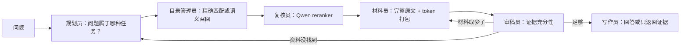
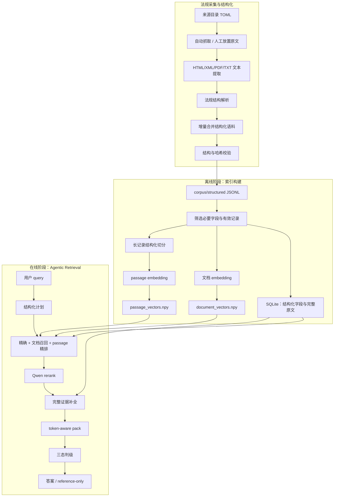
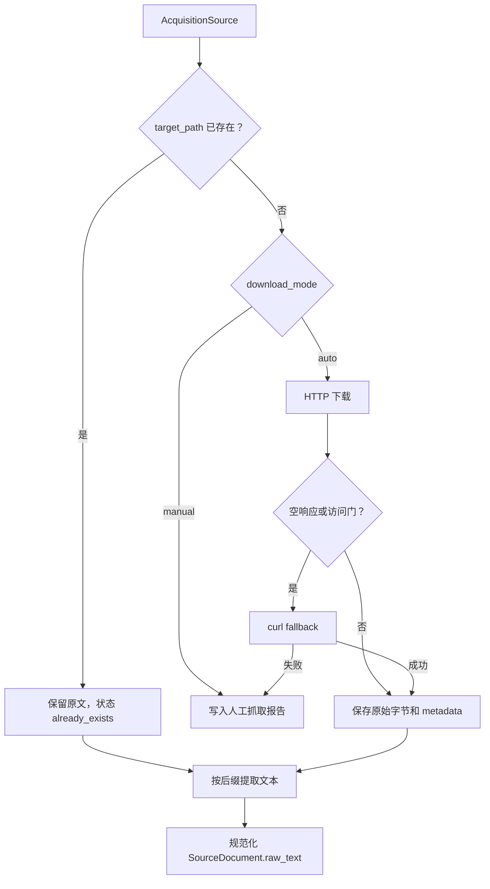
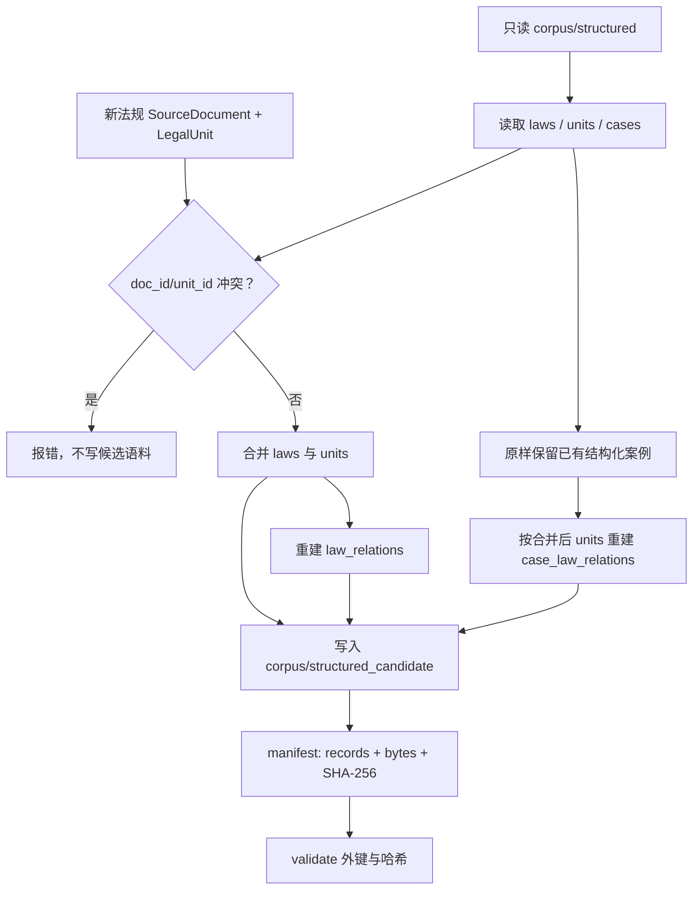
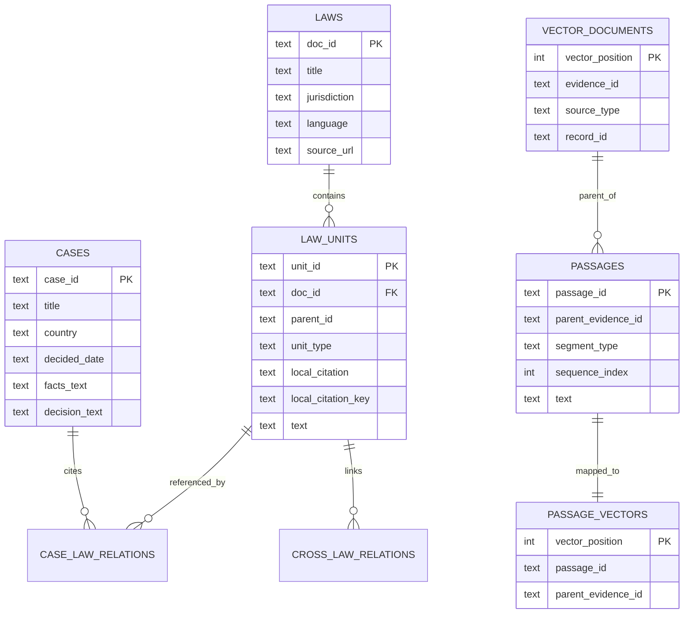
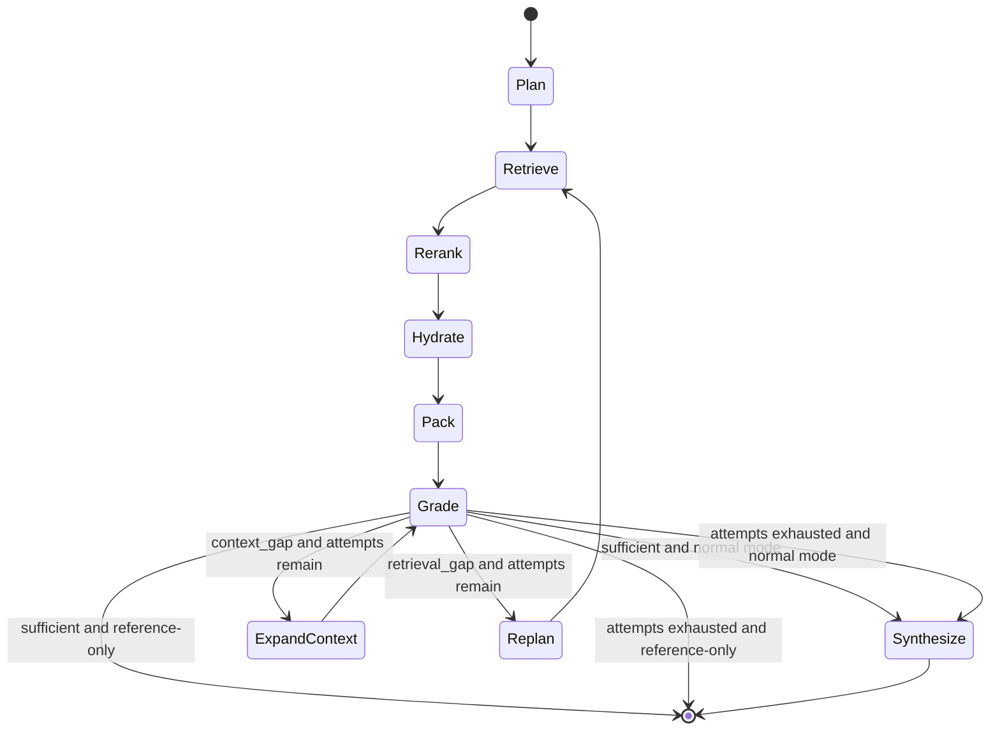
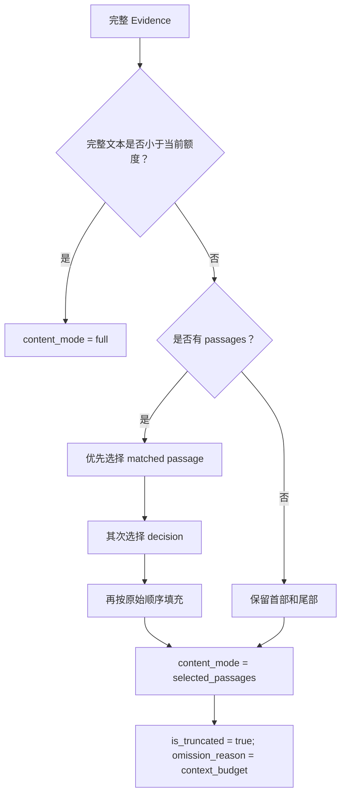
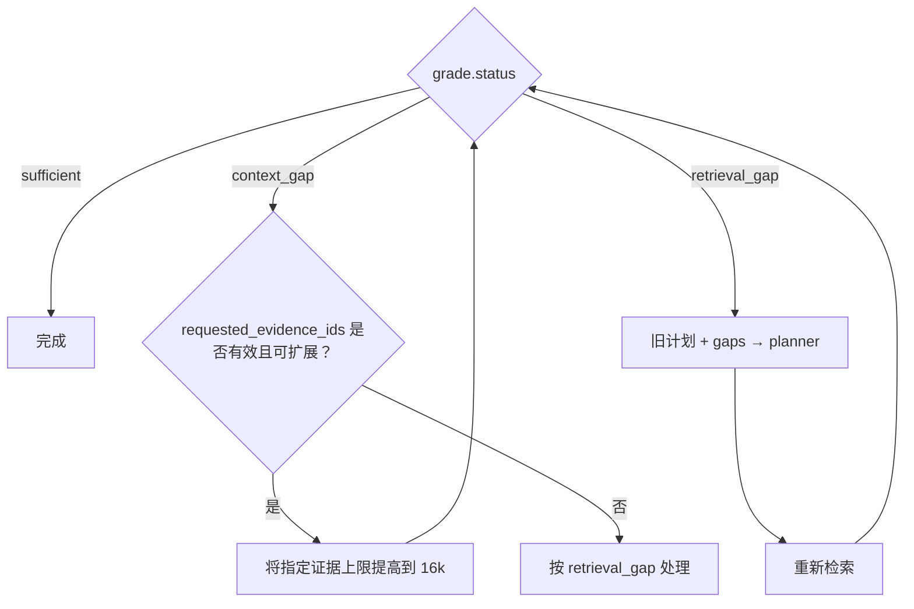
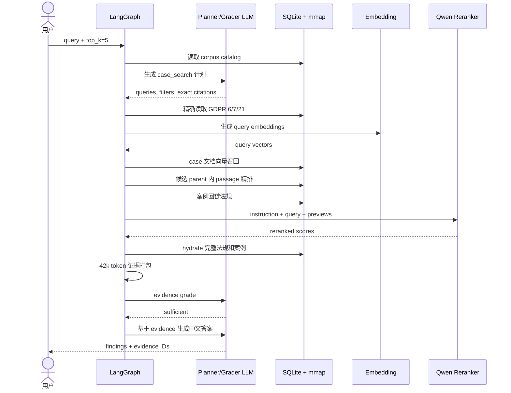

# Law Centre Agent 算法与数据结构

本文解释系统为什么这样设计、一次查询如何流动、每个数据文件保存什么，以及发生证据不足时 Agent 如何恢复。读者不需要了解 LangGraph、向量数据库或法律检索。

## 1. 先用一个类比理解

可以把系统想成一个由五类角色组成的法律图书馆：

1. **规划员**先读用户问题，判断是在找一条法规、分析风险、做比较，还是找案例；
2. **目录管理员**按法规编号精确找条款，或按语义从全部资料中找候选；
3. **复核员**用 Qwen reranker 把真正相关的候选排到前面；
4. **材料员**拿回完整法规/案例，并在有限上下文中装配证据包；
5. **审稿员**检查证据是否足够。如果缺的是上下文，就多取相关段落；如果根本没找到对应资料，就重新制定检索计划。

最后，写作员只能基于已经核验的证据回答，并且每项结论都必须标出证据 ID。



## 2. 系统要解决的问题

### 2.1 四种任务

| 任务 | `task` | 最低证据要求 |
|---|---|---|
| 精确法规 | `exact_law` | 用户指定的法规单元 |
| 风险识别 | `risk` | 适用法规，最好包含事实相似案例 |
| 法域/案例比较 | `compare` | 每个比较对象都应有对应证据 |
| 案例搜索 | `case_search` | 至少包含案例证据，不能只返回法规 |

### 2.2 设计目标

- 明确引用优先走确定性检索，不让向量相似度决定“Article 6”是哪一条；
- 同时支持法规和案例，且案例能够回链已解析法条；
- 长材料既能被语义命中，又不会全部塞进 60k 上下文；
- 区分“候选找错了”和“候选正确但上下文取少了”；
- 最终回答必须由返回证据支撑；
- 不在代码里维护国家别名表、欧盟成员清单、概念词典或大量引用正则。

### 2.3 非目标

- 不替代律师进行最终法律判断；
- 不把 GDPRhub 摘要当成原始判决全文；
- 不保证语料覆盖所有国家或全部历史版本；
- 当前向量扫描不是为上亿条记录设计的分布式 ANN 系统。

## 3. 总体架构

系统分为三个阶段：法规采集与结构化、离线索引构建、在线查询。



## 4. 法规采集与增量入库

这一层的目标不是直接回答问题，而是把一份来源可追溯的法规原文变成可检索的结构化法规单元。

### 4.1 来源目录

每部待新增法规由 TOML 中的一个 `[[sources]]` 描述：

```text
doc_id             法规及版本的稳定唯一标识
title              官方标题
jurisdiction       发布法域
law_family         选择哪个结构解析器
source_type        通常为 primary_law
version_date       当前输入文本对应的版本日期
effective_date     生效日期
language           文本语言
url                官方来源地址
preferred_format   html | xml | pdf | txt
download_mode      auto | manual
target_path        原始文件的确定性落盘路径
```

`law_family` 的作用仅是选择 parser。例如同属 EU 结构的 GDPR 和 AI Act 都按 recital/article/paragraph/point 层次解析。它不是在线查询阶段的概念词典，也不决定用户 query 的语义扩展。

### 4.2 采集与提取



HTML 下载器还会处理常见分页页和嵌入式文档 iframe。抓取失败不会创建伪造正文，而是保留来源元数据并列入人工处理报告。

### 4.3 结构解析

parser 将连续正文拆成 `LegalUnit`：

```text
LegalUnit
├── unit_id                 稳定主键
├── source_doc_id           所属法规
├── parent_id               父 article/section，可为空
├── unit_type               recital/article/section/paragraph/point...
├── canonical_citation      跨系统显示引用
├── local_citation          法规内部精确引用
├── text                    该单元完整文本
├── span_ids                回到原文位置的锚点
├── parser_confidence       解析置信度
└── effective_from/to       时间有效性
```

解析器依据的是法规真实排版结构，而不是为某个测试 query 写特例。输入结构未知、`law_family` 未注册或无法产生任何单元时，增量流程立即失败。

### 4.4 安全增量合并

统一命令 `law-corpus-tool add`（也可用 `python -m crawler.law_corpus.law_update add`）执行以下事务式流程：



核心不变量：

1. 基础目录永远只读，输出目录必须不同且为空；
2. 已存在 `doc_id` 不允许覆盖，新版本应使用新的版本化 ID；
3. 已有案例不需要重新抓取，结构化记录原样保留；
4. 法规关系按合并后的全部单元重建；
5. 输出只有通过唯一性、外键和 manifest 校验后才能用于建索引。

这是一种“生成候选版本，再切换”的发布方式。代价是关系重建需要扫描全部法规单元，但数据规模在万级时更容易验证，也避免原地修改造成半成品语料。

### 4.5 采集层产物

| 文件/目录 | 内容 |
|---|---|
| `corpus/sources/*.toml` | 官方来源、版本和落盘位置 |
| `corpus/raw/laws/**` | 原始 HTML/XML/PDF/TXT 与 metadata |
| `corpus/structured/laws.jsonl` | 法规级记录及规范化全文 |
| `corpus/structured/legal_units.jsonl` | 可精确检索的法规结构单元 |
| `corpus/structured/law_relations.jsonl` | 法条之间已解析的引用关系 |
| `corpus/structured/gdprhub_cases.jsonl` | 已有结构化案例摘要 |
| `corpus/structured/case_law_relations.jsonl` | 案例到法规单元的关系 |
| `corpus/structured/manifest.json` | 文件记录数、字节数和 SHA-256 |
| `corpus/structured_candidate/update_report.json` | 本次新增法规、解析数量与抓取状态 |

## 5. 离线索引构建

### 5.1 输入文件

构建器只读取五类源数据：

| 文件 | 用途 |
|---|---|
| `laws.jsonl` | 法规目录、法域、来源 URL 和版本信息 |
| `legal_units.jsonl` | article、section、paragraph 等法规单元 |
| `gdprhub_cases.jsonl` | 案例标题、事实、决定、国家、日期等 |
| `case_law_relations.jsonl` | 已解析的案例—法条关系 |
| `law_relations.jsonl` | 跨法规单元关系 |

### 5.2 必要数据投影

不是所有源字段都进入运行索引：

1. 法规只保留 `is_current=true` 的单元；
2. 所有当前法规单元进入 SQLite，以支持精确引用和完整原文补全；
3. 只有没有子节点的叶子法规单元生成文档向量，避免父条款与子条款重复；
4. 案例必须至少具有 facts 或 decision；
5. 只保留 `resolution_status=resolved` 的案例—法条关系；
6. 只保留 `relation_scope=cross_law` 的法规关系；
7. `laws.raw_text` 等查询不需要的大字段不复制到运行索引。

当前投影结果：

| 指标 | 数量 |
|---|---:|
| 法规 | 25 |
| 当前法规单元 | 7,634 |
| 生成文档向量的叶子法规单元 | 6,930 |
| 案例 | 3,369 |
| 案例—法条关系 | 10,821 |
| 跨法规关系 | 116 |
| 文档向量总数 | 10,299 |
| passage 向量总数 | 1,370 |

### 5.3 文档 embedding 内容

法规单元 embedding 文本由以下字段按行拼接：

```text
法规标题
法域
canonical citation
法规单元完整文本
```

案例 embedding 文本由以下字段按行拼接：

```text
案例标题
监管机构/法院
国家
行业
类别
facts_text
decision_text
```

因此，embedding 对象是：

- 叶子 `law_unit`；
- `case`；
- 超过长度阈值的 law/case passage。

不是每个父级法规节点都重复 embedding。

### 5.4 passage 切分

只有估算长度超过 `PASSAGE_THRESHOLD_TOKENS=1600` 的记录才切分。

切分遵守原始结构：

- 法规按自身 `unit_type` 切分；
- 案例先分为 `facts` 与 `decision` 两个 segment；
- segment 内优先按空行分段；
- 没有清晰段落时按中英文句末符号切分；
- 仍然过长的原子文本才使用带 overlap 的滑动窗口。

默认值：

```text
目标长度：800 estimated tokens
最大长度：1,000 estimated tokens
相邻窗口 overlap：100 estimated tokens
```

passage ID 是稳定的层次标识：

```text
{parent_evidence_id}:passage:{segment_type}:{sequence_index}
```

例如：

```text
case:gdprhub:4539:passage:decision:2
```

### 5.5 原子写入

构建时先生成三个临时文件：临时 SQLite、临时文档向量、临时 passage 向量。全部成功后使用原子替换发布。这样 embedding 服务中途失败时，不会留下“文件名正确但内部不完整”的正式索引。

## 6. 运行时数据文件

### 6.1 三文件一致性

```text
data/corpus_v3.sqlite3
data/corpus_v3.document_vectors.npy
data/corpus_v3.passage_vectors.npy
```

SQLite metadata 保存：

- `schema_version`；
- `embedding_model`；
- `embedding_dimension`；
- `document_vector_count`；
- `passage_vector_count`；
- `passage_threshold_tokens`。

加载索引时会校验 schema、模型名和向量维度。三个文件任意一个缺失都会直接失败，不会静默回退到错误数据。

### 6.2 SQLite 关系图



`vector_position` 是 SQLite 行与 NumPy 矩阵行之间的桥梁。例如 `vector_position=15` 对应 `.npy` 矩阵第 15 行。

### 6.3 为什么向量不放进 SQLite

4096 维 float32 向量体积较大。NumPy `.npy` 支持 memory map：操作系统按需读取候选页，不需要一次性把全部约 182MB 向量复制到 Python 堆内存。SQLite 更适合精确字段、关系和完整文本。

## 7. Python 核心数据结构

### 7.1 RetrievalRequest

```python
RetrievalRequest(
    text: str,
    top_k: int = 10,
    response_language: str = "zh-CN",
    reference_only: bool = False,
)
```

- `text`：原始用户问题；
- `top_k`：最终证据数，范围 1–50；
- `response_language`：最终答案语言；
- `reference_only`：保留完整 Agentic 检索，但跳过答案生成。

### 7.2 RetrievalPlan

```python
RetrievalPlan(
    task,
    queries,
    filters,
    exact_citations,
    comparison_targets,
    reasoning,
)
```

`filters` 只能包含：

```text
jurisdictions
countries
doc_ids
source_types = law_unit | case
date_from
date_to
```

模型输出会经过结构化解析。未知 task、空 queries、无效 source type 会被拒绝或清理。`case_search` 即使模型遗漏了 `case`，代码也会补上这一来源不变量。

### 7.3 Evidence

| 字段 | 含义 |
|---|---|
| `evidence_id` | 全流程稳定 ID，如 `law_unit:...` 或 `case:...` |
| `source_type` | `law_unit` 或 `case` |
| `title`、`citation` | 人类可读来源信息 |
| `text` | 当前准备交给模型的证据文本 |
| `score` | embedding 或 reranker 分数 |
| `matched_passage_ids` | passage 精排命中的段落 |
| `content_mode` | `preview`、`full` 或 `selected_passages` |
| `original_tokens` | 完整证据估算 token 数 |
| `included_tokens` | 当前证据包实际包含的估算 token 数 |
| `is_truncated` | 是否因上下文预算选择了部分 passage |
| `omission_reason` | 当前为 `context_budget` 或空 |
| `metadata` | unit_id、case_id、日期、机构等结构化字段 |

重要区别：`is_truncated=true` 表示“给模型的上下文是部分 passage”，不表示 SQLite 保存的源记录残缺。

### 7.4 AgentState

LangGraph 节点通过一个显式状态对象通信：

```text
request             原始请求
plan                当前检索计划
evidence            预览或最终打包证据
hydrated_evidence   从 SQLite 补全后的完整证据
grade               证据判级结果
attempt             已使用的恢复次数
answer              最终答案
```

节点返回局部更新，由 LangGraph 合并到状态，减少隐藏的全局状态。

## 8. 在线查询完整流程



### 8.1 Plan：把自然语言变成可执行计划

planner 会看到：

- 用户问题；
- SQLite catalog 中真实存在的法规 `doc_id`、法域和引用格式示例；
- 真实存在的案例国家、法域和日期范围；
- 重新规划时的旧计划与证据缺口。

它负责：

1. 选择四种 task 之一；
2. 生成一个或多个适合语料语言的检索 query；
3. 只使用 catalog 中存在的过滤值；
4. 对明确条款输出 `doc_id + local_citation`；
5. 比较任务列出 comparison targets。

系统不通过国家别名表或概念词典决定这些内容，而是让 LLM 结合当前 catalog 输出结构化结果。

### 8.2 Exact retrieval：明确条款的确定性匹配

引用匹配键进行 Unicode NFKC 规范化、大小写折叠，并仅保留字母数字字符。

```text
"ARTICLE 6" → "article6"
"Article 6" → "article6"
```

随后执行：

```sql
WHERE doc_id = ? AND local_citation_key = ?
```

这避免了向量检索把 Article 6 误匹配成语义相近的 Article 7。

### 8.3 Document recall：第一阶段语义召回

对 planner 生成的每个 query 计算 embedding。索引向量和 query 向量都经过 L2 归一化，因此内积等价于余弦相似度：

```math
score(d) = max_q (d · q)
```

多个 query 中取最大分数，使中文原问题、英文法律术语和不同表述能够共同参与召回。

在计算分数前，SQLite 先根据以下结构化字段缩小候选：

- source type；
- law jurisdiction；
- case country；
- doc_id；
- case date range。

初始召回数量为：

```text
max(top_k × 4, 20)
```

这给 reranker 留出足够候选，而不是只重排已经被 embedding 严格截断的 top-k。

### 8.4 Passage refine：候选内部第二阶段精排

passage 搜索不是对全部 1,370 个 passage 独立进行全局召回。它只在文档阶段已经召回的 parent evidence 内计算 passage 分数：

```text
文档候选集合 D
→ 查出 parent_evidence_id ∈ D 的 passages
→ passage embedding 与所有 query embedding 内积
→ 保存每个 evidence 的 matched_passage_ids
```

这样兼顾：

- 文档级上下文，避免孤立段落失去来源；
- 局部精度，长案例中只有 decision 某一段相关时也能命中；
- 较低计算量。

passage 最高分可以提升父文档的召回分数。

### 8.5 关系扩展

如果候选中存在案例，系统读取 `case_law_relations`，补充这些案例已解析引用的法规单元。关系扩展只使用已解析关系，不通过字符串猜测案例引用。

### 8.6 Qwen rerank

embedding 适合快速扩大召回，reranker 同时读取 query 与文档预览，更适合判断事实、争议点和结论是否真正相关。

发送给 vLLM `/rerank` 的字段彼此分离：

```json
{
  "instruction": "Given a legal research query, ...",
  "query": "用户原始问题",
  "documents": ["标题 | 引用 | 法域\n短预览"],
  "top_n": 5
}
```

instruction 使用英文，因为 Qwen3-Reranker 官方训练中的 instruction 主要为英文。文档只发送短预览，避免对最终不会采用的长文重复消耗 reranker 上下文。

### 8.7 来源覆盖与案例槽位

单纯按 reranker 分数截断可能出现一种错误：planner 要求案例，但多个精确法规占满 `top_k`，最后一个案例被裁掉。

合并算法先为缺失的必需来源选一个 coverage evidence，再放精确法规和其他重排结果：

```text
coverage evidence
+ exact citations
+ reranked candidates
+ embedding candidates
→ 按 evidence_id 去重
→ 截断到 top_k
```

因此 `case_search` 至少保留一个 case。如果 `doc_id` 通过案例—法条关系过滤得到零案例，系统会移除这个间接 `doc_id` 约束重试案例语义召回，但保留用户国家和日期约束。

### 8.8 Hydrate：从预览恢复完整证据

召回和 rerank 阶段只需要短预览。候选确定后，hydrate 按 `unit_id` 或 `case_id` 从 SQLite 读取：

- 法规单元完整 `text`；
- 案例完整 `facts_text + decision_text`；
- 该 evidence 的全部 passages；
- 之前命中的 passage IDs。

这是解决“GDPR Article 6 在预览 1000 字符处被误判截断”的关键：模型判级和生成看到的是 hydrate 后的证据，而不是 reranker 预览。

### 8.9 Token-aware evidence packing

默认模型上下文约 60k，不能把任意数量完整案例全部发送。证据预算默认为 42k，剩余空间留给系统提示、用户问题、JSON 结构和最多 8k 输出。

#### 优先级

证据排序键为：

```text
精确引用优先
→ grader 请求扩展的 evidence 优先
→ 分数从高到低
```

#### 单条上限

| 证据类别 | 默认上限 |
|---|---:|
| 精确法规 | 12,000 |
| 普通法规 | 6,000 |
| 案例 | 8,000 |
| grader 指定扩展证据 | 16,000 |

#### 公平保留

打包前一条证据时，会为后面的每条候选至少预留 256 estimated tokens。这样比较任务不会因前几个长法域材料耗尽预算，导致最后一个比较对象完全不可见。

#### 完整还是 passage



### 8.10 离线 token 估算

为了避免首次运行时在线下载 tokenizer，系统使用确定性字符权重估算：

- 中文及其他非 ASCII 字符约计 1 unit；
- ASCII 字母数字约计 0.25 unit；
- ASCII 标点约计 0.5 unit；
- 空白约计 0.1 unit；
- 总数乘以 `TOKEN_SAFETY_FACTOR=1.2` 并向上取整。

这不是 Qwen tokenizer 的精确计数，但安全系数和额外 prompt 预留可以降低溢出风险。若以后服务端提供精确 tokenizer，只需替换 `TokenCounter`，打包算法接口不变。

### 8.11 Grade：三态证据判级

grader 不直接回答问题，只判断当前 evidence 能否支撑回答：

| 状态 | 含义 | 下一步 |
|---|---|---|
| `sufficient` | 已覆盖问题所需内容 | 生成答案或结束 reference-only |
| `context_gap` | 正确 evidence 已存在，但部分 passage 未装入上下文 | 扩展指定 evidence 后重新判级 |
| `retrieval_gap` | 所需法规、法域、概念或案例根本未出现 | 带 gaps 重新规划并检索 |



`requested_evidence_ids` 必须属于当前 evidence 且 `is_truncated=true`。模型请求扩展一个已经完整的证据会被拒绝。

恢复次数由 `max_replans` 限制，默认 1、最大 3，防止图无限循环。

### 8.12 Synthesize：受证据约束的回答

synthesizer 接收最终 evidence 和 grade，并被要求：

- 所有用户可见字段使用 `response_language`，默认中文；
- 不发明法规、事实、判决、引用或法域；
- 每个实质 finding 引用至少一个 `evidence_id`；
- 风险仅描述为潜在风险，不直接宣告违法；
- 明确 GDPRhub 是二手摘要；
- 区分上下文 passage 选择和源材料本身缺失。

生成后还有确定性校验：

1. 收集当前允许的 evidence IDs；
2. 删除 finding 中模型虚构的 ID；
3. 如果一个 finding 没有任何有效 ID，删除整个 finding；
4. 统一 limitations 为字符串数组。

### 8.13 Reference-only

`reference_only=true` 不等于“只跑一次向量搜索”。它仍执行：

```text
plan → retrieve → rerank → hydrate → pack → grade
                        ↑                 │
                        └── replan/expand ┘
```

当证据充分或恢复次数用尽时，跳过 synthesize，只返回：

```json
{
  "reference_only": true,
  "evidence": []
}
```

因此返回的是 Agentic 流程确认后的最终证据，而不是未经检查的首轮候选。

## 9. 一次查询的时序

下面以“搜索未经同意发送营销邮件的 GDPR 案例”为例：



## 10. 任务特有规则

### 10.1 exact_law

- 精确引用结果固定保留；
- 如果精确匹配成功，可以不做语义召回；
- hydrate 后尽可能提供完整条款；
- 对完整条款不得报告“文本被截断”。

### 10.2 risk

- 通常要求 law_unit 和 case；
- 根据用户事实找相似事实和适用法条；
- 案例相似不代表当前用户必然违法；
- 缺少特定法域或案例时必须写入 limitations。

### 10.3 compare

- planner 明确 comparison targets；
- grader 检查每个 target 是否有证据；
- 只找到两国法规、没有其中一国案例时，可以做法规对比，但不能声称完成案例实践比较。

### 10.4 case_search

- `case` 是强制来源不变量；
- 精确法规不能挤掉全部案例槽位；
- 找到案例后可以补充案例引用的法条；
- 输出应区分案例 facts、decision/outcome 和相关法律背景。

## 11. 正确性不变量

以下规则不依赖 LLM 是否“听话”：

1. `task` 只能是四个白名单值；
2. `case_search` 必须包含 case source；
3. 精确引用必须同时具有 `doc_id` 和 `local_citation`；
4. source type 只能是 `law_unit` 或 `case`；
5. embedding 模型名与维度必须匹配索引 metadata；
6. evidence 按 `evidence_id` 去重；
7. case_search 最终 top-k 为案例预留来源覆盖；
8. grader 只能请求扩展当前已截断 evidence；
9. finding 只能引用当前返回的 evidence ID；
10. 恢复循环次数有上限；
11. reference-only 不调用 synthesizer；
12. 三个索引文件必须同时存在。

## 12. 复杂度与性能

设：

- `N`：文档向量数，当前 10,299；
- `D`：向量维度，当前 4,096；
- `Q`：planner 生成的 query 数；
- `P_c`：文档候选内部的 passage 数；
- `K`：最终 top-k。

### 文档召回

当前是过滤候选上的精确矩阵内积：

```text
时间：O(N × D × Q)
向量存储：O(N × D)，使用 mmap
```

### passage 精排

```text
时间：O(P_c × D × Q)
```

因为 passage 只限于文档候选 parent，`P_c` 通常远小于全局 passage 数。

### rerank

输入候选约为 `max(4K, 20)` 加少量关系扩展记录，复杂度主要由 reranker 模型和文档预览长度决定。

### hydrate

对最终 K 条 evidence 进行 SQLite 主键查询，并读取对应 passage，规模近似 O(K)。

### pack

证据排序约 O(K log K)，passage 选择与被选证据的 passage 总数线性相关。

当前 1 万级文档使用 NumPy 精确扫描简单且可复现。若增长到百万级，可以把 document recall 替换为 FAISS/HNSW，但精确引用、关系扩展、hydrate、pack 和 LangGraph 无需改变。

## 13. 失败模式与系统响应

| 失败情况 | 系统行为 |
|---|---|
| 索引文件缺失 | 启动时抛出 `FileNotFoundError` |
| 新法规 URL 无法访问 | 写入人工抓取报告，不生成候选语料 |
| 新法规结构没有 parser | 明确报错，不静默生成空 `LegalUnit` |
| 新法规 `doc_id` 与基础语料冲突 | 拒绝合并，要求使用版本化 ID |
| 候选语料输出目录非空 | 拒绝覆盖 |
| corpus manifest 或关系引用错误 | `validate` 返回失败，不进入索引构建 |
| embedding 维度不一致 | 拒绝加载索引 |
| LLM 返回非法 task | 拒绝计划 |
| case_search 计划遗漏 case | 自动补充 case source |
| doc_id 关系过滤导致零案例 | 清除间接 doc_id，保留国家/日期后重试 |
| reranker 不可用且未禁用 | HTTP 错误直接暴露，不伪装成功 |
| reranker 被配置为 disabled | 保留原始候选顺序 |
| 正确证据只装入部分 passage | `context_gap`，扩展指定证据 |
| 所需法域/案例完全没找到 | `retrieval_gap`，重新规划 |
| 恢复次数用尽 | 基于现有证据回答并明确 limitations，或返回现有 references |
| 模型虚构 evidence ID | 删除无效引用及无依据 finding |

## 14. 如何调参

### 想提高召回率

- 增大 `top_k`；
- 检查 planner queries 是否覆盖语料语言；
- 调整 embedding 模型；
- 降低过严的结构化过滤；
- 检查案例—法条关系解析覆盖率。

### 想提高排序精度

- 使用更强的 Qwen3-Reranker；
- 保持法律任务英文 `RERANK_INSTRUCTION`；
- 改善 rerank preview 中的标题、引用、事实和决定摘要；
- 用人工标注 query–evidence 集合评估 Recall@K、MRR、nDCG。

### 遇到上下文超限

- 降低 `EVIDENCE_TOKEN_BUDGET`；
- 降低单证据上限；
- 减少 `top_k`；
- 使用模型的精确 tokenizer 替代近似计数；
- 不要简单截断完整法规开头，优先保留 matched passages。

### 比较任务遗漏某个法域

- 查看最终 `comparison_targets`；
- 检查该法域在 catalog 中是否真实存在；
- 检查 packer 是否给每条候选保留最小预算；
- 查看 grader 是 `context_gap` 还是 `retrieval_gap`。

## 15. 测试策略

测试使用小型临时语料和确定性 FakeEmbedder，覆盖：

- 新法规离线解析、增量合并和案例保留；
- `doc_id` 冲突与原地写入保护；
- corpus manifest、SHA-256 和关系外键校验；
- 非当前法规不会进入索引；
- 精确引用大小写规范化；
- 完整法规 hydrate，不再停留于 1000 字符预览；
- passage 命中和 parent 回链；
- 来源过滤；
- 案例—法规关系扩展；
- reranker 丢弃某来源时的 coverage 保留；
- 精确法规占满 top-k 时仍保留 case；
- doc_id 间接过滤零案例时回退；
- context_gap 只扩展证据，不重新规划；
- reference-only 仍判级但不调用 synthesize；
- Qwen reranker instruction 与 query 分字段发送；
- evidence token 总量不超过预算；
- 模型虚构 evidence ID 被过滤。

运行：

```bash
python -m pytest -q
python -m ruff check src tests
python -m ruff format --check src tests
```

## 16. 代码导航

| 需要理解或修改的部分 | 文件 |
|---|---|
| LangGraph 节点与路由 | `src/legal_agentic_retrieval/graph.py` |
| 请求、计划、证据结构 | `src/legal_agentic_retrieval/models.py` |
| SQLite schema 与双层向量 | `src/legal_agentic_retrieval/index.py` |
| LLM、embedding、reranker | `src/legal_agentic_retrieval/providers.py` |
| token 预算与 passage 选择 | `src/legal_agentic_retrieval/evidence.py` |
| 离线 token 估算与结构化切分 | `src/legal_agentic_retrieval/tokenization.py` |
| 环境变量与预算校验 | `src/legal_agentic_retrieval/config.py` |
| CLI | `src/legal_agentic_retrieval/cli.py` |
| 新增法规统一 CLI | `src/crawler/law_corpus/law_update.py` |
| 法规来源目录读取 | `src/crawler/law_corpus/catalog.py` |
| 下载、分页和访问门检测 | `src/crawler/law_corpus/acquire.py` |
| HTML/XML/PDF/TXT 提取 | `src/crawler/law_corpus/extract_text.py` |
| 法规结构 parser 注册表 | `src/crawler/law_corpus/parsers/registry.py` |
| 增量语料关系与 manifest | `src/crawler/law_corpus/corpus_store.py` |
| GDPRhub API 客户端与案例解析 | `src/crawler/law_corpus/case_sources/gdprhub.py` |
| GDPRhub 案例采集命令 | `tools/acquire_gdprhub_cases.py` |
