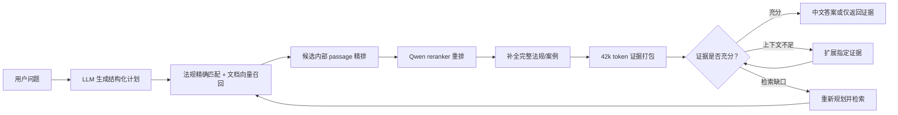

# Law Centre Agent

一个可独立运行的法律 Agentic Retrieval 项目。它使用 LangGraph 组织检索流程，在法规单元和 GDPRhub 案例摘要上完成：

- 精确检索指定法规条款；
- 根据用户提供的业务描述发现法律风险；
- 比较概念在不同法域、法规和案例中的差异；
- 搜索事实相似的案例并回链相关法条；
- 仅返回最终检索证据，不生成自然语言答案。

项目默认使用中文生成答案。运行时不依赖原来的 `law_centre_lightrag_based` 仓库。

详细算法、数据结构和流程图见 [ALGORITHM.md](ALGORITHM.md)。

## 一分钟理解

系统不是把全部法律文本直接交给大模型。它先让 LLM 把问题转成结构化检索计划，再用向量索引召回候选、用 Qwen reranker 重排、补全候选的完整原文，并在 60k 上下文限制内选择证据。最后由证据判级节点决定直接回答、扩展上下文，还是重新检索。



## 项目目录

```text
law_centre_agent/
├── .env                     # 本地模型端点配置，已被 gitignore
├── .env.example             # 可复制的配置模板
├── README.md                # 安装、运行和维护说明
├── ALGORITHM.md             # 详细算法与数据结构文档
├── pyproject.toml
├── data/
│   ├── corpus_v3.sqlite3
│   ├── corpus_v3.document_vectors.npy
│   └── corpus_v3.passage_vectors.npy
├── corpus/
│   ├── sources/             # 法规来源目录和新增法规示例
│   ├── raw/laws/            # 已下载的法规原文
│   └── structured/          # 当前索引对应的结构化基础语料
├── tools/                   # 可单独运行的底层采集/解析脚本
├── src/crawler/law_corpus/
│   ├── law_update.py        # 新增法规统一工具
│   ├── acquire.py           # HTTP 下载、分页和 iframe 处理
│   ├── extract_text.py      # HTML/XML/PDF/TXT 文本提取
│   └── parsers/             # EU、中国、美国等法规结构解析器
├── src/legal_agentic_retrieval/
│   ├── cli.py               # 命令行入口
│   ├── config.py            # 环境变量与预算校验
│   ├── models.py            # 请求、计划、证据和图状态
│   ├── index.py             # 索引构建、精确检索、向量检索和补全
│   ├── providers.py         # LLM、embedding、Qwen reranker 适配器
│   ├── evidence.py          # token-aware 证据打包
│   ├── tokenization.py      # 离线 token 估算
│   └── graph.py             # LangGraph 工作流
└── tests/
```

## 随项目提供的数据

查询需要下面三个文件，并且它们必须来自同一次索引构建：

| 文件 | 作用 | 当前规模 |
|---|---|---:|
| `data/corpus_v3.sqlite3` | 法规、案例、关系、完整文本、passage 元数据 | 约 34 MB |
| `data/corpus_v3.document_vectors.npy` | 叶子法规单元和案例的文档向量 | 10,299 × 4,096，约 161 MB |
| `data/corpus_v3.passage_vectors.npy` | 长法规和长案例的 passage 向量 | 1,370 × 4,096，约 21 MB |

SQLite 当前包含 25 部法规、7,634 个有效法规单元和 3,369 个案例。只有 6,930 个叶子法规单元进入文档向量，避免父子条款重复。

项目还携带约 20 MB 法规原文和约 54 MB `corpus/structured` 基础语料，供新增法规与重建索引使用。没有复制约 417 MB 的 GDPRhub 原始抓取页，因为新增法规不需要重新抓取案例；已有结构化案例会在增量合并时原样保留。

## 环境要求

- Python 3.11 或更高版本；
- 推荐使用 conda 环境 `dev`；
- 一个 OpenAI-compatible LLM 服务；
- 一个 OpenAI-compatible embedding 服务；
- 一个支持 `/rerank` 的 Qwen3-Reranker 服务；
- 模型名称和 embedding 维度必须与索引 metadata 一致。

当前随项目移动的 `.env` 可以直接用于本机测试。为其他环境配置时：

```bash
cp .env.example .env
```

然后填写模型地址、模型名和 API key。`.env` 不应提交到版本控制。

## 安装

```bash
cd /Users/zhexuansoffice/Developments/law_centre_agent
conda activate dev
python -m pip install -e '.[dev]'
```

也可以不激活环境：

```bash
conda run -n dev python -m pip install -e '.[dev]'
```

## 模型端点检查

该命令会检查 LLM、embedding、reranker，并读取已经提供的 v3 索引 catalog，不需要结构化基础语料：

```bash
python -m legal_agentic_retrieval.cli \
  --env-file .env \
  smoke \
  --index data/corpus_v3.sqlite3
```

成功输出中三个部分的 `ok` 均应为 `true`。

## 查询

### 1. 精确法规

```bash
python -m legal_agentic_retrieval.cli \
  --env-file .env \
  query 'GDPR 第六条的内容' \
  --index data/corpus_v3.sqlite3 \
  --top-k 5
```

对于明确条款，planner 会输出 `doc_id + local_citation`，系统使用 SQLite 确定性匹配，而不是只依赖向量相似度。

### 2. 风险识别

```bash
python -m legal_agentic_retrieval.cli \
  --env-file .env \
  query '用户注册后，我们未单独征得同意就持续向其邮箱发送营销邮件，请识别风险并给出法规和案例依据' \
  --index data/corpus_v3.sqlite3 \
  --top-k 8
```

风险结论只是基于当前证据的风险指示，不等于确认违法，也不替代律师意见。

### 3. 跨法域比较

```bash
python -m legal_agentic_retrieval.cli \
  --env-file .env \
  query '对比中国 PIPL 与欧盟 GDPR 对处理合法性基础和同意的要求，并说明案例差异' \
  --index data/corpus_v3.sqlite3 \
  --top-k 10
```

如果某个法域没有案例，grader 会返回 `retrieval_gap`，最终答案必须明确说明缺口，不会虚构覆盖。

### 4. 案例搜索

```bash
python -m legal_agentic_retrieval.cli \
  --env-file .env \
  query '搜索未经有效同意发送直接营销邮件的 GDPR 案例，说明事实和监管结论' \
  --index data/corpus_v3.sqlite3 \
  --top-k 5
```

`case_search` 强制保留案例来源。即使精确法规数量占满 `top_k`，系统也会为必需的案例证据预留槽位。

### 5. Reference-only

只需要最终证据、不需要自然语言答案时：

```bash
python -m legal_agentic_retrieval.cli \
  --env-file .env \
  query '未经有效同意发送营销邮件的案例' \
  --index data/corpus_v3.sqlite3 \
  --top-k 5 \
  --reference-only
```

该模式仍会执行判级、上下文扩展和必要的重新检索，只跳过最终答案生成。输出只有：

```json
{
  "reference_only": true,
  "evidence": []
}
```

## Python API

```python
from legal_agentic_retrieval.config import ModelConfig
from legal_agentic_retrieval.evidence import EvidencePacker
from legal_agentic_retrieval.graph import LegalRetrievalAgent
from legal_agentic_retrieval.index import RetrievalIndex
from legal_agentic_retrieval.models import RetrievalRequest
from legal_agentic_retrieval.providers import (
    CohereReranker,
    OpenAIEmbedder,
    OpenAILegalPlanner,
)
from legal_agentic_retrieval.tokenization import TokenCounter

config = ModelConfig.from_env(".env")
embedder = OpenAIEmbedder(config)
counter = TokenCounter(safety_factor=config.token_safety_factor)
index = RetrievalIndex("data/corpus_v3.sqlite3", embedder)

agent = LegalRetrievalAgent(
    index=index,
    planner=OpenAILegalPlanner(config),
    reranker=CohereReranker(config),
    evidence_packer=EvidencePacker(
        counter,
        total_budget=config.evidence_token_budget,
    ),
    max_replans=1,
)

result = agent.invoke(
    RetrievalRequest(
        text="GDPR 第六条的内容",
        top_k=5,
        response_language="zh-CN",
    )
)
```

## 主要参数

| 参数 | 默认值 | 含义 |
|---|---:|---|
| `--top-k` | 10 | 最终证据数量，允许范围 1–50 |
| `--max-replans` | 1 | 最多恢复次数，允许范围 0–3 |
| `--response-language` | `zh-CN` | 最终答案语言 |
| `--reference-only` | false | 只返回最终证据 |
| `EVIDENCE_TOKEN_BUDGET` | 42,000 | 交给 grader/synthesizer 的证据预算 |
| `LLM_CONTEXT_WINDOW` | 60,000 | LLM 上下文上限 |
| `TOKEN_SAFETY_FACTOR` | 1.2 | 离线 token 估算安全系数 |
| `PASSAGE_THRESHOLD_TOKENS` | 1,600 | 超过该长度才建立 passage 向量 |
| `PASSAGE_TARGET_TOKENS` | 800 | passage 目标长度 |
| `PASSAGE_MAX_TOKENS` | 1,000 | passage 最大长度 |

完整环境变量示例见 `.env.example`。

## 输出说明

普通模式返回：

- `summary`：中文摘要；
- `findings`：结论、风险等级、证据 ID 和不确定性；
- `limitations`：数据或证据缺口；
- `disclaimer`：非法律建议声明；
- `task`、`plan`：最终任务分类和检索计划；
- `evidence_grade`：充分性状态；
- `evidence`：最终证据。

每个 finding 必须引用有效 `evidence_id`。模型虚构的 ID 会被过滤；没有有效证据的 finding 不会进入输出。

`Evidence.is_truncated=true` 只表示由于上下文预算选择了部分 passage，不表示 SQLite 中的原始法规或案例被截断。

## 重新构建索引（可选）

日常查询不需要 `corpus/structured`。只有法规、案例、embedding 模型或 passage 参数变化时才需要重建。

构建器需要外部目录中存在以下文件：

```text
laws.jsonl
legal_units.jsonl
gdprhub_cases.jsonl
case_law_relations.jsonl
law_relations.jsonl
```

例如从本项目自带的基础语料重建：

```bash
python -m legal_agentic_retrieval.cli \
  --env-file .env \
  build \
  --corpus-dir corpus/structured \
  --index data/corpus_v3_rebuilt.sqlite3
```

构建过程先写临时 SQLite 和向量文件，全部成功后再原子替换目标文件。不要只复制三个索引文件中的一部分。

## 新增法规

新增法规采用“新目录发布”，不会直接修改 `corpus/structured` 或当前 `data/corpus_v3.*`。完整流程是：


### 1. 创建新增法规目录

复制示例文件：

```bash
cp corpus/sources/laws.custom.example.toml corpus/sources/laws.custom.toml
```

每个 `[[sources]]` 表示一部法规。最重要的字段是：

| 字段 | 含义 |
|---|---|
| `doc_id` | 稳定且带版本的唯一 ID；不能与基础语料重复 |
| `law_family` | 选择结构解析器，不是用于在线检索的概念词典 |
| `url` | 官方法规地址 |
| `preferred_format` | `html`、`xml`、`pdf` 或 `txt` |
| `download_mode` | `auto` 自动下载；`manual` 要求人工保存原文 |
| `target_path` | 原始文件在本项目内的落盘位置 |

现有解析器覆盖 EU GDPR/AI Act/Data Act/DGA/DSA/NIS2、中国 PIPL/DSL/CSL、美国 CFR/州隐私法，以及当前目录中的英联邦和主要市场法规族。`law_family` 不在注册表中时会直接报错；这说明新法规结构尚未得到验证，需要先新增解析器和测试。

### 2. 先检查目录

```bash
python -m crawler.law_corpus.law_update catalog \
  --catalog corpus/sources/laws.custom.toml
```

### 3. 抓取、解析并生成候选语料

```bash
python -m crawler.law_corpus.law_update add \
  --catalog corpus/sources/laws.custom.toml \
  --base-corpus corpus/structured \
  --output-corpus corpus/structured_candidate
```

如果 `download_mode = "manual"`，先按生成的 `corpus/raw/manual_fetch.new_laws.md` 保存官方原文，再重复命令；如果原文已经位于 `target_path`，可以使用：

```bash
python -m crawler.law_corpus.law_update add \
  --catalog corpus/sources/laws.custom.toml \
  --base-corpus corpus/structured \
  --output-corpus corpus/structured_candidate \
  --skip-acquire
```

工具会保留基础语料中的案例，重新生成法规关系和案例—法规关系，并写出 `update_report.json` 与 `manifest.json`。它拒绝：

- 直接写回基础目录；
- 覆盖非空输出目录；
- 使用已经存在的 `doc_id`；
- 原文缺失、格式不支持或一个法规单元都未解析出来的输入。

### 4. 校验候选语料

```bash
python -m crawler.law_corpus.law_update validate \
  --corpus-dir corpus/structured_candidate
```

`valid` 必须为 `true`。校验内容包括唯一 ID、外键引用、关系目标、manifest 记录数和 SHA-256。

### 5. 构建并测试新索引

先使用新文件名，避免覆盖正在使用的索引：

```bash
python -m legal_agentic_retrieval.cli \
  --env-file .env \
  build \
  --corpus-dir corpus/structured_candidate \
  --index data/corpus_v4.sqlite3

python -m legal_agentic_retrieval.cli \
  --env-file .env \
  query '查询新增法规中的目标条款' \
  --index data/corpus_v4.sqlite3 \
  --top-k 5 \
  --reference-only
```

确认新增法规可精确召回、原有法规和案例仍可召回后，再把部署配置切换到 `corpus_v4.sqlite3`。SQLite、document vectors 和 passage vectors 必须作为同一组发布。

### 底层爬虫脚本

统一工具适合常规新增法规；需要逐阶段排错时，可使用 `tools/` 中的脚本：

```bash
python tools/acquire_law_sources.py --catalog corpus/sources/laws.custom.toml
python tools/build_source_documents.py \
  --catalog corpus/sources/laws.custom.toml \
  --out corpus/normalized/source_documents.custom.jsonl
python tools/parse_legal_units.py \
  --source-documents corpus/normalized/source_documents.custom.jsonl \
  --out corpus/parsed/legal_units.custom.jsonl \
  --require-all
```

这些脚本主要用于诊断。正式增量发布优先使用 `python -m crawler.law_corpus.law_update add`，因为它同时执行冲突检查、案例保留、关系重建和 manifest 生成。

项目也保留了 GDPRhub 案例采集入口；新增法规不需要运行它。需要补充案例时，先用 dry-run 检查范围：

```bash
python tools/acquire_gdprhub_cases.py \
  --all-pages \
  --all-pages-limit 20 \
  --dry-run
```

案例全量原始页体积较大，默认不随本项目复制；当前 `corpus/structured` 中的结构化案例可直接继续使用。

## 测试

```bash
conda activate dev
python -m pytest -q
python -m ruff check src tests
python -m ruff format --check src tests
```

只测试爬虫和新增法规链路：

```bash
python -m pytest tests/crawler -q
```

## 检索评测集

`evals/benchmark_v0.jsonl` 提供 24 条结构化评测样本，四类任务各 6 条，并划分为 16 条 dev 和 8 条 test。当前标签状态为 `silver`：全部 evidence 已通过索引结构校验，但仍需要法律专业人员复核后才能升级为人工 `gold`。

```bash
python -m legal_agentic_retrieval.eval_cli validate \
  --dataset evals/benchmark_v0.jsonl \
  --index data/corpus_v3.sqlite3

python -m legal_agentic_retrieval.eval_cli run \
  --dataset evals/benchmark_v0.jsonl \
  --split dev \
  --index data/corpus_v3.sqlite3 \
  --env-file .env \
  --output evals/results/dev.jsonl

python -m legal_agentic_retrieval.eval_cli score \
  --dataset evals/benchmark_v0.jsonl \
  --results evals/results/dev.jsonl \
  --split dev
```

评测器输出 Recall@K、RequiredRecall@K、MRR、nDCG、Precision 和比较对象覆盖率。完整标注规范和防止 test 泄漏的流程见 [evals/README.md](evals/README.md)。

## 已知边界

- GDPRhub 是二手案例摘要，不等于判决全文；
- 爬虫只自动获取公开且无需认证的来源；访问门、验证码和许可限制会转为人工抓取报告；
- 同一法规的新版本应使用新的版本化 `doc_id`，当前工具不做就地替换或历史版本迁移；
- 新文档结构必须先实现并测试对应 parser，不能只通过更换 `law_family` 强行套用；
- 当前语料并不保证每个国家都有案例；
- 文档向量搜索当前为 NumPy mmap 上的精确内积扫描，数据进一步增大后可替换为 ANN；
- token 数是离线确定性估算，不是 Qwen tokenizer 的精确计数，因此使用 1.2 安全系数；
- 系统不内置国家别名表、欧盟成员表、概念词典或引用正则，法域和查询扩展由 LLM 计划完成，并由结构化字段约束。
